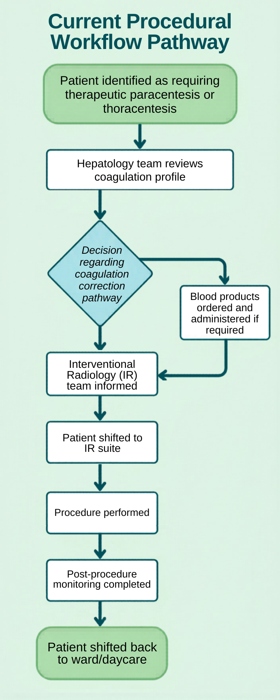
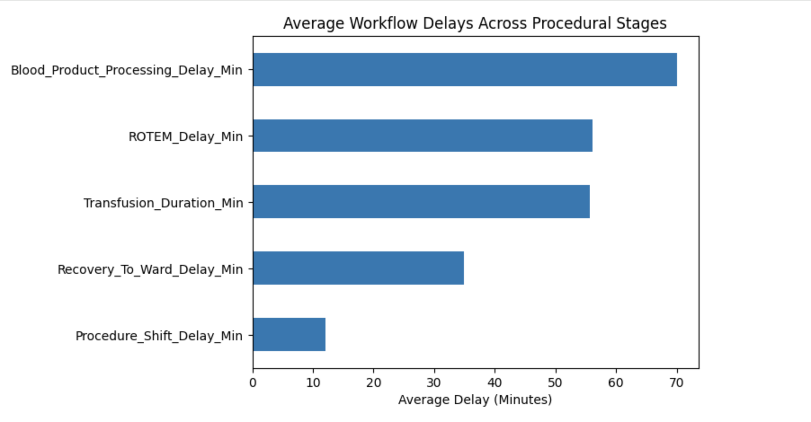
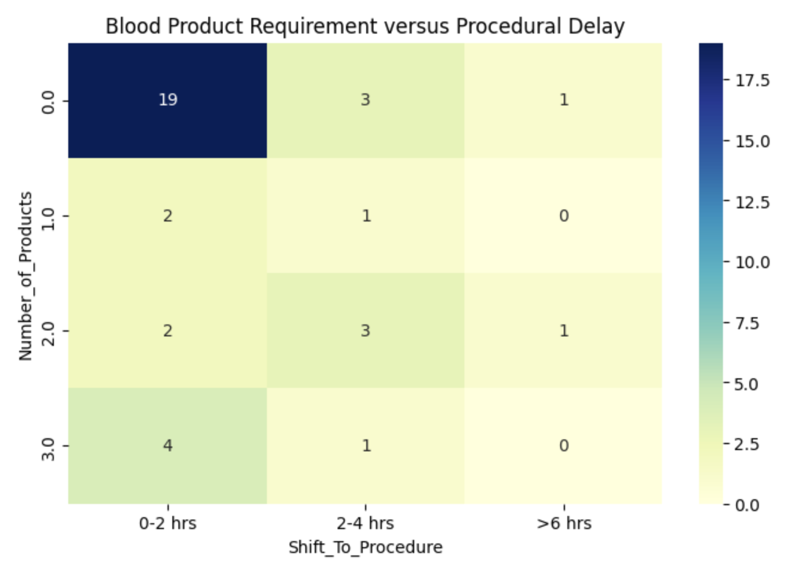
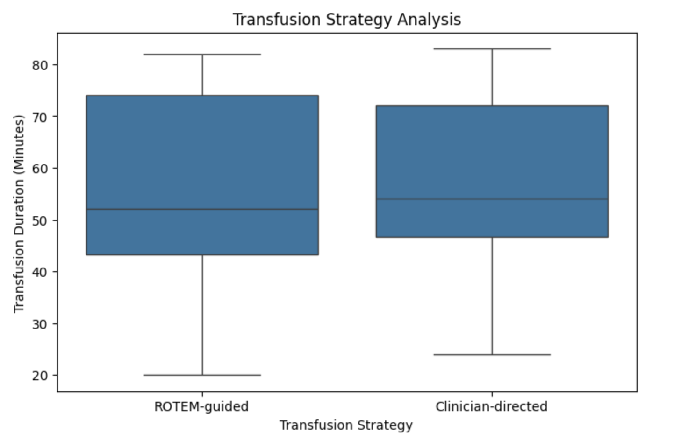

# Workflow Audit of Therapeutic Paracentesis and Thoracentesis Among Hepatology Patients

*A Retrospective and Prospective Service Evaluation*

---

## Project Overview

This project presents a retrospective and prospective workflow audit evaluating delays associated with therapeutic paracentesis and thoracentesis among hepatology patients requiring interventional procedures.

The audit was designed to identify operational bottlenecks affecting patient progression from hepatology review to procedural intervention, particularly among patients requiring coagulation assessment and blood product correction.

The project combined retrospective workflow review with structured prospective workflow interval analysis to evaluate multidisciplinary coordination challenges, workflow delays, and procedural inefficiencies across the patient pathway.

---

## Current Procedural Workflow Pathway



The procedural workflow pathway involved coordination between hepatology services, blood bank services, nursing teams, and Interventional Radiology (IR).

Multiple sequential workflow stages contributed to cumulative procedural delay, including:

- coagulation review
- blood product preparation
- transfusion administration
- procedural coordination
- patient transfer

---

## Key Workflow Bottlenecks



Prospective workflow analysis demonstrated that blood product processing, ROTEM processing, and transfusion duration contributed substantially to cumulative procedural delay.

Average total workflow duration from hepatology review to procedural initiation was approximately 224 minutes.

Transfer-related delays were comparatively shorter, suggesting that upstream operational coordination processes contributed more significantly to cumulative workflow inefficiency.

---

## Blood Product and Procedural Delay Analysis



Patients requiring larger numbers of blood products demonstrated greater variability in procedural delays, particularly within intermediate delay intervals.

These findings highlight the operational impact of coagulation correction pathways, blood product preparation, and multidisciplinary coordination processes.

---

## Transfusion Strategy Workflow Analysis



Both ROTEM-guided and clinician-directed transfusion pathways demonstrated variability in transfusion duration.

Median transfusion durations appeared broadly comparable between pathways, suggesting that procedural delay may be influenced more significantly by blood product coordination and processing logistics than by transfusion strategy alone.

---

## Study Design

### Phase 1 — Retrospective Audit

A one-month retrospective review was performed to:

- Identify workflow patterns
- Evaluate procedural delays
- Assess documentation practices
- Identify limitations in workflow data capture

The retrospective phase identified substantial limitations in timestamp availability and workflow documentation consistency.

---

### Phase 2 — Prospective Service Evaluation

A structured prospective workflow dataset was subsequently developed over a three-month period to:

- Improve workflow timestamp recording
- Quantify workflow intervals more accurately
- Identify operational bottlenecks
- Evaluate multidisciplinary coordination processes
- Assess cumulative procedural delays

Prospective workflow assessment enabled detailed evaluation of multiple workflow intervals across the procedural pathway.

---

## Workflow Parameters Evaluated

The following workflow intervals were analyzed:

- ROTEM processing delay
- Blood product processing delay
- Transfusion duration
- Procedure transfer delay
- Recovery transfer delay
- Total workflow duration

Additional variables included:

- Coagulopathy status
- Transfusion strategy
- Ward versus daycare workflow
- Blood product utilization

---

## Key Findings

The audit identified several recurring operational bottlenecks contributing to cumulative procedural delay, including:

- Blood product preparation and administration
- ROTEM processing delays
- Interdepartmental communication timing
- Sequential workflow coordination
- Patient transfer scheduling variability

Prospective workflow analysis demonstrated that upstream operational coordination processes contributed more significantly to cumulative procedural delay than downstream patient transfer intervals.

---

## Proposed Workflow Improvements

Based on audit findings, a structured fast-track workflow pathway was proposed, including:

- Earlier identification of patients requiring coagulation correction
- Standardized coagulation assessment pathways
- Earlier blood bank coordination
- Parallel workflow preparation where clinically appropriate
- Improved multidisciplinary communication
- Structured workflow timestamp documentation

The proposed pathway was designed to improve operational efficiency, procedural coordination, and patient flow among hepatology patients requiring interventional procedures.

---

## Technologies Used

- Python
- Pandas
- Matplotlib
- Seaborn
- Google Colab

---

## Clinical and Academic Relevance

This project demonstrates:

- Healthcare workflow analytics
- Clinical audit methodology
- Operational bottleneck analysis
- Healthcare quality improvement
- Prospective workflow evaluation
- Multidisciplinary systems analysis
- Clinical data handling and visualization

The project aligns with NHS-style service evaluation and healthcare quality improvement principles.

---

## Repository Structure

```text
IR-Hepatology-Workflow-Audit/
│
├── IR_Hepatology_Workflow_Audit.ipynb
├── workflow_flowchart.png
├── workflow_bottleneck.png
├── blood_product_delay_heatmap.png
├── transfusion_strategy_boxplot.png
└── README.md
```

---

## References

1. Aithal GP, Palaniyappan N, China L, et al. *Guidelines on the management of ascites in cirrhosis.* Gut. 2021.

2. European Association for the Study of the Liver (EASL). *Clinical Practice Guidelines for the management of patients with decompensated cirrhosis.*

3. NICE Guideline NG50: *Cirrhosis in over 16s – assessment and management.*

4. NHS England Quality Improvement Framework.

5. De Pietri L, et al. *Thromboelastographic reference ranges for cirrhosis and coagulation assessment in liver disease.*